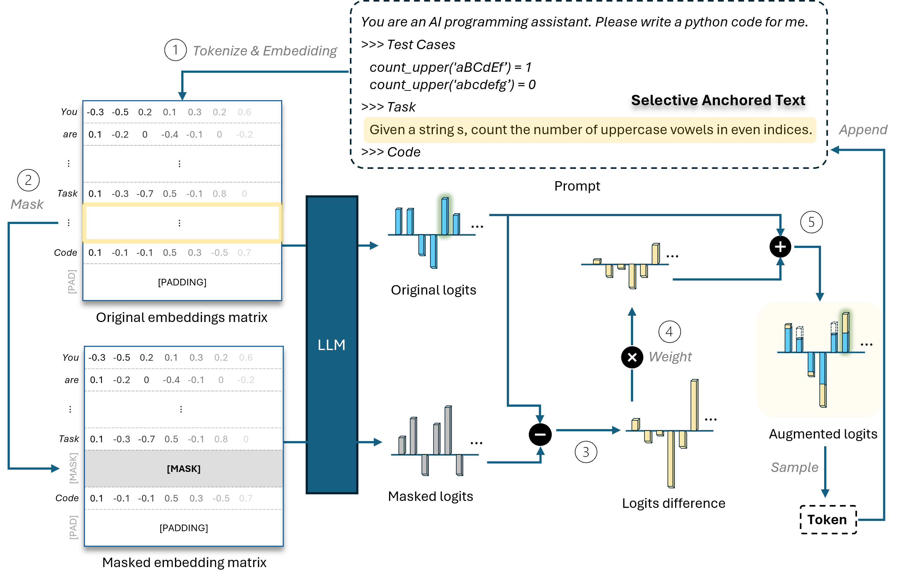

# Selective Prompt Anchoring (SPA)

This repo includes all the code for **S**elective **P**rompt **A**nchoring (SPA). Please check [our paper](https://www.arxiv.org/abs/2408.09121).

SPA enables LLMs to arbitrarily adjust the influence of tokens in the prompt. It helps LLMs focus on the initial prompt and do not deviate from the original goal when generating a long sequence. It is training-free and potentially model-agnostic.

 

  

 

## Environment

Run the following command:

`pip install -r requirements.txt`

## Code

**weighted_text_utils.py** includes all the utils and helper functions. If you want to modify it, the necessary instructions are inside the code file.

**anchor_evaluation.py** serves as the main entry for evaluation. Users can use arguments to specify the evaluation conditions:
1. `checkpoint`: Specify the model path. It can be the HuggingFace checkpoint name.
2. `benchmark`: Specify the benchmark name. For example, *HumanEval* or *MBPP*.
3. `mask_test_case`: If this is true, the test cases will be masked and included in the anchored text.
4. `mask_entire_prompt`: If this is true, the entire prompt will be masked as the anchored text.
5. `mode`: Specify the evaluation mode. Just input "*instruction*" or leave blank for base SPA.
6. `weight`: Specify the weighting value **ω**. **0** means simply using the original model. **<0** means reducing the impact of anchored text, while **>0** means amplifying the impact.
7. `approach`:  Just input "*difference*" or leave blank for base SPA.
8. `note`: Add notes to this experiment. The note text will appear as the prefix of output files (log file and generated data file).
9. `task_id`: If there are multiple GPUs, define the GPU ID to use. 
10. `use_multiple_gpu`: If this is true, evaluation will be conducted on multiple GPUs. You can specify which GPUs to use in [this line](https://github.com/magic-YuanTian/Selective-Prompt-Anchoring/blob/4b637f41e76f5a385aaa51ca4db0ab97859588e0/anchor_evaluation.py#L99).

## How to run

Run **anchor_evaluation.py** with the corresponding arguments for evaluation.

For example: 

  ``python anchor_evaluation.py --benchmark humaneval --checkpoint deepseek-ai/deepseek-coder-6.7b-instruct --mode instruction --note example --task_id 0 --weight 0.275``.

# A cleaned repo, public APIs, and demos are on the way!!

### Repo
A fully refactored repository, including a cleaner and more optimized implementation.
### APIs
- General huggingface API (model.generate())
- Huggingface pipeline API
- PyPI libraries
### Demos
- A website including static examples and a live demo

***Expected in late May 2025...***
